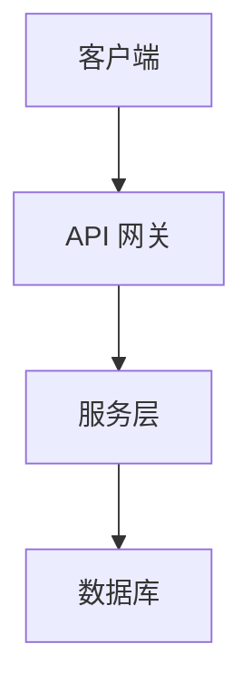

# ARCHITECTURE.md - 系统架构文档

> **版本**: v1.0.0 | **最后更新**: 2026-03-15 | **维护者**: Arch

## 使用说明
此文件由 **Arch** 维护，记录系统架构设计。

## 系统概览

## 技术栈
- **前端**: 
- **后端**: 
- **数据库**: 
- **基础设施**: 

## 架构决策

### [ADR-001] - [决策名称]
- **状态**: Proposed / Accepted / Deprecated
- **背景**: 
- **决策**: 
- **后果**: 

---

## 待更新
- [ ] 系统架构图
- [ ] 技术栈规范
- [ ] API 规范
