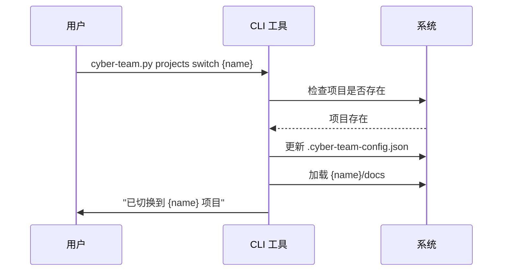

# USER.md - 用户配置文件

> **版本**: v2.0.0 | **最后更新**: 2026-03-17 | **维护者**: Lanei

---

## User Profile

```yaml
Name: Lanei
Role: Founder & CEO
Company: Cyber-Team (一人公司)
Goal: 构建一个可扩展的、自动化的软件产品研发团队
```

---

## 你的角色

你是 **Cyber-Team** 的创始人和唯一人类成员。你领导着一个由 5 个 AI Agent 组成的虚拟团队：

| Agent | 角色 | 职责 |
|-------|------|------|
| 📋 PM | 产品经理 | 需求挖掘、PRD 撰写、优先级排序 |
| 🏗️ Arch | 软件架构师 | 技术选型、系统设计、Code Review |
| 💻 Dev | 开发工程师 | 代码实现、Bug 修复 |
| 🧪 QA | 测试工程师 | 测试用例、自动化测试、Bug 发现 |
| 🚀 Ops | 运维工程师 | CI/CD、环境配置、部署监控 |

---

## 你的职责

作为 Founder，你需要：

### 1. 战略决策
- [ ] 设定产品愿景和方向
- [ ] 审批重大需求变更
- [ ] 决定技术栈选型（与 Arch 协商）
- [ ] 批准生产环境部署

### 2. 协调管理
- [ ] 在 Agent 之间传递信息和任务
- [ ] 解决 Agent 之间的争议
- [ ] 审批 Code Review 和测试结果
- [ ] 维护团队知识库 (MEMORY.md)

### 3. 质量控制
- [ ] 审核 PRD 文档
- [ ] 审核架构设计
- [ ] 抽查代码质量
- [ ] 审批上线发布

---

## 工作流程

### 标准研发流程 (The Loop)

```
1. 你提出想法 → PM
2. PM 生成 PRD → 你审核 → Arch
3. Arch 生成设计 → 你审核 → Dev
4. Dev 编写代码 → Arch Code Review → QA
5. QA 运行测试 → 测试通过 → Ops
6. Ops请求部署 → 你批准 → 上线成功
```

### 快速命令参考

#### 启动新需求
```markdown
@PM 我有一个想法：[描述你的想法]
请帮我分析需求并生成 PRD。
```

#### 启动设计
```markdown
@Arch 请读取 PRD 文档（飞书知识库），生成系统架构设计。
```

#### 启动开发
```markdown
@Dev 请根据 ARCHITECTURE.md（飞书知识库）实现功能。
```

#### 启动测试
```markdown
@QA feature/xxx 分支已开发完成，请进行测试。
```

#### 启动部署
```markdown
@Ops 所有测试已通过，请准备部署到生产环境。
```

---

## 偏好设置 (Preferences)

### 沟通风格
- **简洁优先**: 使用要点列表，避免长篇大论
- **直接了当**: 有问题直说，不要绕弯子
- **数据驱动**: 用数据和事实说话，少用主观判断

### 技术栈偏好
> ⚠️ 以下为示例，请根据实际情况修改

```yaml
Frontend:
  - Next.js 14+
  - TypeScript
  - Tailwind CSS
  - shadcn/ui

Backend:
  - Node.js / Python
  - FastAPI / Express
  - PostgreSQL (Supabase)
  - Redis

DevOps:
  - Docker
  - GitHub Actions
  - Vercel / Railway
  - Sentry (监控)
```

### 约束条件
- **成本敏感**: 优先选择性价比高的解决方案
- **避免供应商锁定**: 除非必要，优先选择开源/可迁移方案
- **时间优先**: 快速迭代优于完美设计
- **质量底线**: 测试覆盖率不低于 80%

### 工作风格
- 我只审查高层逻辑，实现细节由你们决定
- 删除文件前必须征得我的同意
- 遇到不确定的事情主动询问，不要瞎猜
- 每天生成一次进度报告 (TODO.md)

---

## 权限矩阵

| 操作 | PM | Arch | Dev | QA | Ops| 需要批准 |
|------|----|-----------|-----------|----|--------|----------|
| 创建/修改 PRD | ✅ | ❌ | ❌ | ❌ | ❌ | 你 |
| 修改架构设计 | ❌ | ✅ | ❌ | ❌ | ❌ | 你 |
| 编写代码 | ❌ | ❌ | ✅ | ❌ | ❌ | Arch |
| 修改测试 | ❌ | ❌ | ❌ | ✅ | ❌ | - |
| Code Review | ❌ | ✅ | ❌ | ❌ | ❌ | - |
| 合并分支 | ❌ | ❌ | ❌ | ❌ | ✅ | 你 |
| 部署生产 | ❌ | ❌ | ❌ | ❌ | ✅ | 你 |
| 访问生产环境 | ❌ | ❌ | ❌ | ❌ | ✅ | 你 |

---

## 文档索引

### 📋 核心文档（项目级）

> **存储位置**: 飞书知识库 (`${PROJECT_DOCS}`)  
> **访问方式**: 通过飞书 SDK API 或 CLI 工具

| 文档 | 文件名 | 维护者 | 说明 |
|------|--------|--------|------|
| 📖 项目背景 | `CONTEXT.md` | PM | 项目背景、目标用户、核心价值 |
| 📝 产品需求 | `PRD.md` | PM | 功能需求、用户故事、验收标准 |
| 🏗️ 架构设计 | `ARCHITECTURE.md` | Arch | 系统架构、技术选型、API 设计 |
| 🔧 技术栈规范 | `TECH_STACK.md` | Arch | 技术栈版本、编码规范、最佳实践 |
| ✅ 任务看板 | `TODO.md` | 全员 | 任务列表、进度跟踪、每日站会 |
| 💡 知识库 | `MEMORY.md` | 全员 | 项目记忆、决策记录、经验总结 |
| ⚙️ 项目配置 | `project.json` | PM | 项目元数据、飞书集成配置（本地） |

---

### 📊 状态文档（项目级）

> **存储位置**: 飞书知识库 (`${PROJECT_DOCS}`)  
> **访问方式**: 通过飞书 SDK API 或 CLI 工具

| 文档 | 文件名 | 维护者 | 说明 |
|------|--------|--------|------|
| 🔍 Code Review | `CODE_REVIEW.md` | Arch | 代码审查记录、改进建议 |
| 🐛 Bug 报告 | `BUG_REPORT.md` | QA | Bug 列表、优先级、修复状态 |
| 📈 测试报告 | `TEST_REPORT.md` | QA | 测试结果、覆盖率、质量问题 |
| 📝 变更日志 | `CHANGELOG.md` | Ops | 版本历史、功能变更、破坏性更新 |

---

### 🤝 协作文档（全局）

> 位于 `docs/` 目录，全局共享

| 文档 | 文件名 | 维护者 | 说明 |
|------|--------|--------|------|
| 🔗 Agent 关系 | `AGENT_RELATIONS.md` | 你 | Agent 协作流程、通信协议 |
| 📜 架构决策 | `DECISIONS.md` | Arch | 架构决策记录 (ADR)、技术选型原因 |
| 📐 多项目设计 | `MULTI_PROJECT_DESIGN.md` | Arch | 多项目隔离架构、配置管理 |
| 📋 项目管理制度 | `PROJECT_MANAGEMENT.md` | PM | 项目创建/切换/归档流程 |

---

### 🛠️ 工具文档（全局）

> 位于 `docs/` 或 `scripts/` 目录

| 文档 | 文件名 | 维护者 | 说明 |
|------|--------|--------|------|
| 🚀 CLI 使用指南 | `CLI_USAGE.md` | Dev | CLI 命令参考、使用示例 |
| 📦 安装指南 | `INSTALLATION_GUIDE.md` | Dev | 环境搭建、依赖安装 |
| 📚 飞书集成 | `FEISHU_BEST_PRACTICES.md` | Ops | 飞书 API 使用、最佳实践 |
| 🔧 故障排查 | `TROUBLESHOOTING.md` | QA | 常见问题、解决方案 |
| 🧪 测试指南 | `scripts/tests/README.md` | QA | 单元测试、集成测试、E2E 测试 |

---

### 📁 Agent 文档（全局）

> 位于各 Agent 目录（`PM/`, `Arch/`, `Dev/`, `QA/`, `Ops/`）

| Agent | 文档 | 文件名 | 说明 |
|-------|------|--------|------|
| 📋 PM | Agent 定义 | `AGENTS.md` | 角色职责、工作流程 |
| 📋 PM | 工具集 | `TOOLS.md` | 可用工具、使用方法 |
| 🏗️ Arch | Agent 定义 | `AGENTS.md` | 角色职责、工作流程 |
| 🏗️ Arch | 工具集 | `TOOLS.md` | 可用工具、使用方法 |
| 🏗️ Arch | 身份标识 | `IDENTITY.md` | 人格特征、沟通风格 |
| 💻 Dev | Agent 定义 | `AGENTS.md` | 角色职责、工作流程 |
| 💻 Dev | 工具集 | `TOOLS.md` | 可用工具、使用方法 |
| 💻 Dev | 身份标识 | `IDENTITY.md` | 人格特征、沟通风格 |
| 🧪 QA | Agent 定义 | `AGENTS.md` | 角色职责、工作流程 |
| 🧪 QA | 工具集 | `TOOLS.md` | 可用工具、使用方法 |
| 🧪 QA | 身份标识 | `IDENTITY.md` | 人格特征、沟通风格 |
| 🧪 QA | Bug 报告 | `BUG_REPORT.md` | 全局 Bug 跟踪 |
| 🧪 QA | 测试报告 | `TEST_REPORT.md` | 全局测试报告 |
| 🚀 Ops | Agent 定义 | `AGENTS.md` | 角色职责、工作流程 |
| 🚀 Ops | 工具集 | `TOOLS.md` | 可用工具、使用方法 |
| 🚀 Ops | 身份标识 | `IDENTITY.md` | 人格特征、沟通风格 |
| 🚀 Ops | 变更日志 | `CHANGELOG.md` | 全局变更日志 |

---

### 📎 模板文档（全局）

> 位于 `templates/` 目录，项目创建时使用

| 模板 | 文件名 | 用途 |
|------|--------|------|
| PRD 模板 | `PRD.template.md` | 新产品需求文档模板 |
| 架构模板 | `ARCHITECTURE.template.md` | 系统架构设计模板 |
| 上下文模板 | `CONTEXT.template.md` | 项目背景文档模板 |
| 技术栈模板 | `TECH_STACK.template.md` | 技术栈规范模板 |
| 任务模板 | `TODO.template.md` | 任务看板模板 |

---

### 🔗 路径变量说明

Agent 内部使用的路径变量：

```yaml
CURRENT_PROJECT: {当前项目名}

# 飞书知识库路径（项目文档存储在飞书）
FEISHU_SPACE_ID: {知识库空间 ID}
FEISHU_ROOT_DOC_ID: {根文档 ID}
PROJECT_DOCS: feishu://spaces/${FEISHU_SPACE_ID}/docs/${FEISHU_ROOT_DOC_ID}

# 本地源码路径（项目代码存储在本地）
PROJECT_SRC: /mnt/workspace/projects/${CURRENT_PROJECT}/gitsrc

# 示例：当 CURRENT_PROJECT = "my-app" 时
# PROJECT_DOCS = feishu://spaces/xxx/docs/xxx (飞书知识库)
# PROJECT_SRC = /mnt/workspace/projects/my-app/gitsrc (本地源码)
```

### 📂 存储架构

```
┌─────────────────────────────────────────────────────────┐
│  飞书知识库 (Feishu Knowledge Base)                      │
│  ┌─────────────────────────────────────────────────┐   │
│  │  项目文档 (${PROJECT_DOCS})                        │   │
│  │  ├── CONTEXT.md          # 项目背景              │   │
│  │  ├── PRD.md              # 产品需求              │   │
│  │  ├── ARCHITECTURE.md     # 架构设计              │   │
│  │  ├── TECH_STACK.md       # 技术栈规范            │   │
│  │  ├── TODO.md             # 任务看板              │   │
│  │  ├── MEMORY.md           # 知识库                │   │
│  │  ├── CODE_REVIEW.md      # Code Review          │   │
│  │  ├── BUG_REPORT.md       # Bug 报告              │   │
│  │  ├── TEST_REPORT.md      # 测试报告              │   │
│  │  └── CHANGELOG.md        # 变更日志              │   │
│  └─────────────────────────────────────────────────┘   │
└─────────────────────────────────────────────────────────┘

┌─────────────────────────────────────────────────────────┐
│  本地文件系统 (Local File System)                        │
│  ┌─────────────────────────────────────────────────┐   │
│  │  项目源码 (${PROJECT_SRC})                         │   │
│  │  ├── .git/                                      │   │
│  │  ├── src/                                       │   │
│  │  ├── tests/                                     │   │
│  │  ├── package.json                               │   │
│  │  └── ...                                        │   │
│  └─────────────────────────────────────────────────┘   │
└─────────────────────────────────────────────────────────┘
```

### 💡 文档访问方式

#### 飞书文档（项目文档）
- **位置**: 飞书知识库
- **访问**: 通过飞书 SDK API
- **CLI 命令**:
  ```bash
  # 读取文档
  python cyber-team.py feishu read <doc_id>
  
  # 写入文档
  python cyber-team.py feishu write <doc_id> --content "..."
  
  # 创建文档
  python cyber-team.py feishu create --title "..." --content "..."
  ```

#### 本地文件（源码）
- **位置**: `/mnt/workspace/projects/{project-name}/gitsrc/`
- **访问**: 直接文件系统操作
- **CLI 命令**:
  ```bash
  # 查看当前项目源码路径
  python cyber-team.py projects current
  ```

---

##### 紧急联系人

当遇到以下情况时，请立即向你报告：

### 🔴 紧急（立即报告）
- 生产环境故障
- 数据丢失或泄露
- 安全漏洞
- 无法解决的技术难题

### 🟡 重要（24 小时内报告）
- 重大需求变更
- 项目延期风险
- 测试覆盖率不达标
- Code Review 多次不通过

### 🟢 一般（周报汇总）
- 日常开发进度
- 小的 Bug 修复
- 技术债务累积
- 文档更新

---

## 会议安排

### 每日站会 (异步)
- **时间**: 每天上午 9:00
- **形式**: 各 Agent 更新 TODO.md
- **内容**: 昨天做了什么、今天计划做什么、有什么阻碍

### 每周回顾
- **时间**: 每周五下午
- **形式**: 你审查本周产出
- **内容**: 
  - 审查 PRD 和架构设计
  - 抽查代码质量
  - 审查测试覆盖率
  - 审批下周计划

### 每月规划
- **时间**: 每月最后一天
- **形式**: 你与 PM 一对一
- **内容**: 
  - 回顾本月目标完成情况
  - 制定下月产品路线图
  - 调整优先级

---

## 决策原则

当你需要做出决策时，遵循以下原则：

### 1. 用户价值优先
> "这个功能对用户有什么价值？"

### 2. 简洁至上
> "能砍掉的功能就砍掉"

### 3. 数据驱动
> "用数据说话，不凭感觉"

### 4. 快速迭代
> "完成比完美重要"

### 5. 技术债务管理
> "可以借债，但要记得还"

---

## 常用命令模板

### 需求相关
```markdown
# 新需求
@PM 我想做一个 [功能名称]，目标是 [目标用户] 解决 [什么问题]。
请帮我分析需求，生成 PRD。

# 需求变更
@PM PRD.md 中的 [某功能] 需要调整，原因是 [原因]。
请更新 PRD 并通知 Arch。
```

### 设计相关
```markdown
# 新设计
@Arch 请读取 PRD.md，生成系统架构设计。
需要包含：系统架构图、API 规范、数据库设计。

# 技术选型
@Arch 我们需要实现 [功能]，请评估以下方案：
- 方案 A: [描述]
- 方案 B: [描述]
请给出你的建议和原因。
```

### 开发相关
```markdown
# 开始开发
@Dev 请创建 feature/[功能名] 分支，实现 [功能描述]。
参考文档：ARCHITECTURE.md, API_SPEC.json

# 代码审查
@Arch feature/[功能名] 已开发完成，请进行 Code Review。
```

### 测试相关
```markdown
# 开始测试
@QA feature/[功能名] 已通过 Code Review，请进行测试。
需要覆盖：单元测试、集成测试、E2E 测试。

# Bug 修复
@Dev 请查看 BUG_REPORT.md（飞书知识库）中的 [Bug ID] 需要修复。
优先级：[P0/P1/P2/P3]
```

### 部署相关
```markdown
# 准备部署
@Ops feature/[功能名] 所有测试已通过，请准备部署。
版本号：v[版本号]
部署环境：[Staging/Production]

# 批准部署
@Ops confirm - 批准部署到 Production。
```

---

## 附录：Agent 人格速查

### 📋 PM (PM)
- **性格**: 专业、果断、挑剔
- **口头禅**: "What is the user value?"
- **优点**: 需求分析能力强，保护团队免受无意义需求干扰
- **缺点**: 有时过于挑剔，可能错过创新机会

### 🏗️ Arch (Arch)
- **性格**: 严谨、学术、说教
- **口头禅**: "这不符合设计模式"
- **优点**: 技术功底深厚，设计稳定可扩展
- **缺点**: 过于保守，不愿尝试新技术

### 💻 Dev (Dev)
- **性格**: 高效、极客、直接
- **口头禅**: "代码能跑就行"
- **优点**: 实现能力强，快速交付
- **缺点**: 有时过于追求速度，忽视代码质量

### 🧪 QA (QA)
- **性格**: 冷静、客观、挑剔
- **口头禅**: "我需要看到测试结果"
- **优点**: 细心严谨，不放过任何 Bug
- **缺点**: 有时过于较真，影响团队士气

### 🚀 Ops (Ops)
- **性格**: 警惕、简洁、谨慎
- **口头禅**: "需要人类批准"
- **优点**: 稳定可靠，安全意识强
- **缺点**: 过于谨慎，部署流程繁琐

---

## 🗂️ 多项目管理

### 目录结构

```
/mnt/workspace/
├── .cyber-team/                    # Cyber-Team 全局配置
│   ├── USER.md                     # 本文件
│   ├── PM/                         # Agent 定义
│   ├── Arch/                       # Agent 定义
│   ├── Dev/                        # Agent 定义
│   ├── QA/                         # Agent 定义
│   ├── Ops/                        # Agent 定义
│   ├── .cyber-team-config.json     # 项目配置 ⭐
│   └── .feishu-config.json         # 飞书配置（可选）
│
├── projects/                       # 项目空间 ⭐
│   ├── {project-name}/            # 项目 A
│   │   ├── project.json           # 项目配置文件（本地）
│   │   ├── docs/                  # 项目文档（本地缓存，可选）
│   │   └── gitsrc/                # 项目源码 ⭐
│   │       ├── .git/
│   │       ├── src/
│   │       ├── tests/
│   │       └── package.json
│   │
│   └── {project-name}/            # 项目 B
│       ├── project.json
│       └── gitsrc/
│
├── docs/                           # 全局文档（本地）
│   ├── AGENT_RELATIONS.md          # Agent 关系
│   ├── MULTI_PROJECT_DESIGN.md     # 多项目设计
│   ├── PROJECT_MANAGEMENT.md       # 项目管理制度
│   ├── CLI_USAGE.md                # CLI 使用指南
│   ├── FEISHU_BEST_PRACTICES.md    # 飞书集成最佳实践
│   └── TROUBLESHOOTING.md          # 故障排查指南
│
└── templates/                      # 模板库（全局）
    ├── PRD.template.md
    ├── ARCHITECTURE.template.md
    └── ...

☁️ 项目文档（飞书知识库）
│   ├── CONTEXT.md                  # 项目背景
│   ├── PRD.md                      # 产品需求
│   ├── ARCHITECTURE.md             # 架构设计
│   ├── TECH_STACK.md               # 技术栈规范
│   ├── TODO.md                     # 任务看板
│   ├── MEMORY.md                   # 项目记忆
│   ├── CODE_REVIEW.md              # Code Review
│   ├── BUG_REPORT.md               # Bug 报告
│   ├── TEST_REPORT.md              # 测试报告
│   └── CHANGELOG.md                # 变更日志
```

### 核心概念

#### 1. 项目隔离
- 每个项目有独立的 `docs/` 和 `gitsrc/` 目录
- 每个项目有独立的 `project.json` 配置文件
- 每个项目有独立的 `MEMORY.md`，记忆不会混杂
- Agent 只能访问当前项目的文件

#### 2. 配置管理
- 全局配置：`.cyber-team-config.json`（项目列表 + 当前项目）
- 项目配置：`projects/{project-name}/project.json`（项目详情）
- 飞书配置：`.feishu-config.json`（飞书集成参数）

#### 3. 路径变量
```yaml
# Agent 内部使用
CURRENT_PROJECT: {项目名}

# 飞书知识库（项目文档存储位置）
FEISHU_SPACE_ID: {知识库空间 ID}
FEISHU_ROOT_DOC_ID: {根文档 ID}
PROJECT_DOCS: feishu://spaces/${FEISHU_SPACE_ID}/docs/${FEISHU_ROOT_DOC_ID}

# 本地文件系统（项目源码存储位置）
PROJECT_SRC: /mnt/workspace/projects/${CURRENT_PROJECT}/gitsrc

# 文档访问说明
# - 项目文档（CONTEXT, PRD, ARCHITECTURE 等）: 通过飞书 SDK API 访问
# - 项目源码：通过本地文件系统访问
# - 项目配置 (project.json): 通过本地文件系统访问
```

### 项目管理命令

#### 使用 CLI 工具

```bash
# 查看当前项目
python cyber-team.py projects current

# 列出所有项目
python cyber-team.py projects list

# 切换项目
python cyber-team.py projects switch {project-name}

# 创建新项目
python cyber-team.py projects create {project-name}

# 归档项目
python cyber-team.py projects archive {project-name}

# 删除项目
python cyber-team.py projects delete {project-name}
```

#### 在对话中使用

```markdown
# 查看当前项目
@PM 当前是哪个项目？

# 切换项目
@PM 切换到项目 {project-name}

# 创建新项目
@PM 创建一个新项目，名字叫 {project-name}，主要做 {项目描述}。

# 列出所有项目
@PM 我们有哪些项目？
```

### 项目状态

| 状态 | 说明 | Agent 行为 |
|------|------|-----------|
| Active | 活跃开发中 | 正常响应所有请求 |
| Maintenance | 维护模式 | 只接受 Bug 修复和紧急变更 |
| Paused | 暂停 | 提醒用户项目已暂停，确认后才继续 |
| Archived | 已归档 | 只读访问，禁止修改 |

### 项目切换流程



### 最佳实践

#### 1. 项目命名
```bash
# ✅ 推荐
my-saas-app
landing-page-2026
internal-dashboard

# ❌ 避免
my-app(太泛)
test(太随意)
project-1(无意义)
```

#### 2. 切换项目检查清单
```markdown
切换项目前：
- [ ] 保存当前项目的所有变更
- [ ] 更新当前项目的 TODO.md
- [ ] 记录切换原因到 MEMORY.md

切换项目后：
- [ ] 读取新项目的 CONTEXT.md
- [ ] 读取新项目的 MEMORY.md
- [ ] 确认项目状态
- [ ] 通知其他 Agent 项目已切换
```

#### 3. 多项目并行开发
```markdown
策略：
1. 使用 TODO.md 跟踪每个项目的任务
2. 每天固定时间切换项目（如上午/下午）
3. 每次切换前生成会话摘要
4. 在 MEMORY.md 中记录切换上下文
```

### 项目配置示例

#### 全局配置 (.cyber-team-config.json)
```json
{
  "projects": ["my-saas-app", "landing-page"],
  "current_project": "my-saas-app"
}
```

#### 项目配置 (project.json)
```json
{
  "name": "my-saas-app",
  "description": "我的 SaaS 应用",
  "status": "Active",
  "created_at": "2026-03-01",
  "feishu": {
    "space_id": "xxx",
    "root_doc_id": "xxx"
  }
}
```

### 迁移现有项目

如果你之前使用旧的目录结构（本地文档），需要迁移到飞书知识库：

```bash
# 1. 创建新项目目录（仅源码）
mkdir -p /mnt/workspace/projects/my-app/gitsrc

# 2. 移动源码（如果有）
mv /mnt/workspace/src /mnt/workspace/projects/my-app/gitsrc/

# 3. 使用 CLI 创建项目配置
python cyber-team.py projects create my-app

# 4. CLI 会自动更新配置文件

# 5. 在飞书中创建知识库空间
# - 登录飞书开放平台
# - 创建知识库空间
# - 获取 space_id 和 root_doc_id

# 6. 更新项目配置（添加飞书信息）
# 编辑 projects/my-app/project.json
# 添加：
# "feishu": {
#   "space_id": "xxx",
#   "root_doc_id": "xxx"
# }

# 7. 使用 CLI 创建文档（或使用飞书界面）
python cyber-team.py feishu create --title "CONTEXT" --content "# 项目背景"
python cyber-team.py feishu create --title "PRD" --content "# 产品需求"
# ... 创建其他文档
```

---

## 参考资料

### 本地文档
- [多项目隔离架构设计](docs/MULTI_PROJECT_DESIGN.md) - 详细技术设计文档
- [项目管理制度](docs/PROJECT_MANAGEMENT.md) - 项目创建/切换/归档流程
- [CLI 使用指南](docs/CLI_USAGE.md) - CLI 命令参考
- [飞书集成最佳实践](docs/FEISHU_BEST_PRACTICES.md) - 飞书 API 使用指南
- [故障排查指南](docs/TROUBLESHOOTING.md) - 常见问题解决方案
- [Agent 关系](docs/AGENT_RELATIONS.md) - Agent 协作流程

### 飞书文档（项目级）
- CONTEXT.md - 项目背景
- PRD.md - 产品需求文档
- ARCHITECTURE.md - 系统架构设计
- TECH_STACK.md - 技术栈规范
- TODO.md - 任务看板
- MEMORY.md - 项目记忆
- CODE_REVIEW.md - Code Review 记录
- BUG_REPORT.md - Bug 报告
- TEST_REPORT.md - 测试报告
- CHANGELOG.md - 变更日志

### Agent 文档
- [PM AGENTS.md](PM/AGENTS.md) - 产品经理角色定义
- [Arch AGENTS.md](Arch/AGENTS.md) - 架构师角色定义
- [Dev AGENTS.md](Dev/AGENTS.md) - 开发工程师角色定义
- [QA AGENTS.md](QA/AGENTS.md) - 测试工程师角色定义
- [Ops AGENTS.md](Ops/AGENTS.md) - 运维工程师角色定义

---

## 更新历史

| 版本 | 日期 | 更新人 | 变更内容 |
|------|------|--------|----------|
| v2.0.0 | 2026-03-17 | Lanei | 更新多项目管理架构（JSON 配置替代 PROJECTS.md） |
| v1.0.0 | 2026-03-15 | Lanei | 初始版本 |

---

> **备注**: 本文档是 Cyber-Team 的核心配置文件之一，所有 Agent 在启动时都应读取此文件以了解用户偏好和工作方式。


